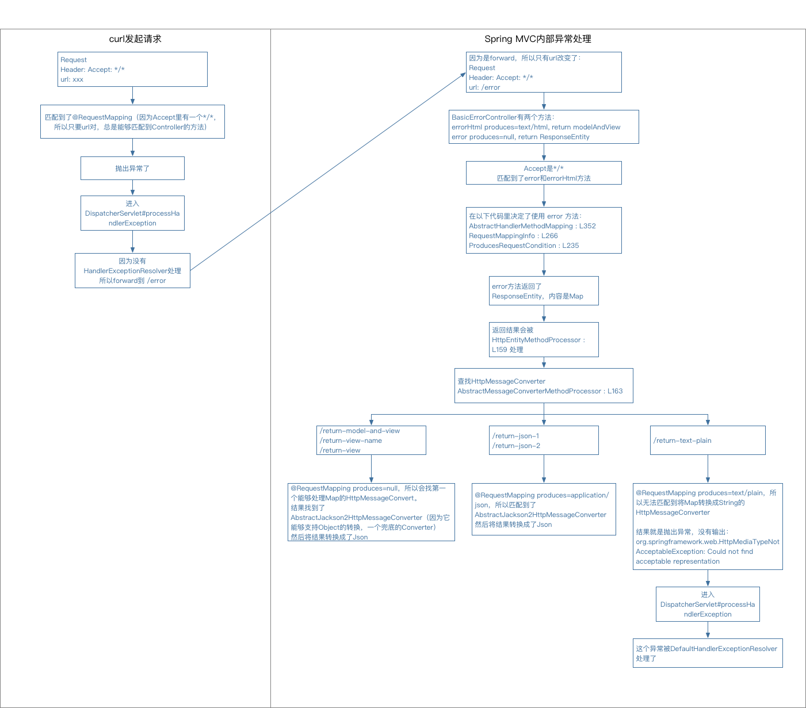

# Spring Boot & Spring MVC 异常处理的N种方法

参考文档：

* Spring Boot 1.5.4.RELEASE [Documentation][spring-boot-doc]
* Spring framework 4.3.9.RELEASE [Documentation][spring-mvc-doc]
* [Exception Handling in Spring MVC][blog-exception-handling-in-spring-mvc]


## 默认行为

根据Spring Boot官方文档的说法：

> For machine clients it will produce a JSON response with details of the error, the HTTP status and the exception message. For browser clients there is a ‘whitelabel’ error view that renders the same data in HTML format

也就是说，当发生异常时：

* 如果请求是从浏览器发送出来的，那么返回一个`Whitelabel Error Page`
* 如果请求是从machine客户端发送出来的，那么会返回相同信息的`json`

你可以在浏览器中依次访问以下地址：

1. http://localhost:8080/return-model-and-view
1. http://localhost:8080/return-view-name
1. http://localhost:8080/return-view
1. http://localhost:8080/return-text-plain
1. http://localhost:8080/return-json-1
1. http://localhost:8080/return-json-2

会发现[FooController][def-foo]和[FooRestController][def-foo-rest]返回的结果都是一个`Whitelabel Error Page`也就是html。

但是如果你使用`curl`访问上述地址，那么返回的都是如下的`json`：

```json
{
  "timestamp": 1498886969426,
  "status": 500,
  "error": "Internal Server Error",
  "exception": "me.chanjar.exception.SomeException",
  "message": "...",
  "trace": "...",
  "path": "..."
}
```

但是有一个URL除外：`http://localhost:8080/return-text-plain`，它不会返回任何结果，原因稍后会有说明。

本章节代码在[me.chanjar.boot.def][pkg-me.chanjar.boot.def]，使用[DefaultExample][boot-DefaultExample]运行。

注意：我们必须在`application.properties`添加`server.error.include-stacktrace=always`才能够得到stacktrace。

### Spring MVC处理请求的总体流程


### 分析为何浏览器访问都`Whitelabel Error Page`


### 分析为何curl text/plain资源却没有返回结果

如果你在[logback-spring.xml][logback-spring.xml]里一样配置了这么一段：

```xml
<logger name="org.springframework.web.servlet.mvc.method.annotation.ServletInvocableHandlerMethod" level="TRACE"/>
```

那么你就能在日志文件里发现这么一个异常：

```
... TRACE 13387 --- [nio-8080-exec-2] .w.s.m.m.a.ServletInvocableHandlerMethod : Invoking 'org.springframework.boot.autoconfigure.web.BasicErrorController.error' with arguments [org.apache.catalina.core.ApplicationHttpRequest@1408b81]
... TRACE 13387 --- [nio-8080-exec-2] .w.s.m.m.a.ServletInvocableHandlerMethod : Method [org.springframework.boot.autoconfigure.web.BasicErrorController.error] returned [<500 Internal Server Error,{timestamp=Thu Nov 09 13:20:15 CST 2017, status=500, error=Internal Server Error, exception=me.chanjar.exception.SomeException, message=No message available, trace=..., path=/return-text-plain, {}>]
... TRACE 13387 --- [nio-8080-exec-2] .w.s.m.m.a.ServletInvocableHandlerMethod : Error handling return value [type=org.springframework.http.ResponseEntity] [value=<500 Internal Server Error,{timestamp=Thu Nov 09 13:20:15 CST 2017, status=500, error=Internal Server Error, exception=me.chanjar.exception.SomeException, message=No message available, trace=..., path=/return-text-plain, {}>]
HandlerMethod details: 
Controller [org.springframework.boot.autoconfigure.web.BasicErrorController]
Method [public org.springframework.http.ResponseEntity<java.util.Map<java.lang.String, java.lang.Object>> org.springframework.boot.autoconfigure.web.BasicErrorController.error(javax.servlet.http.HttpServletRequest)]
org.springframework.web.HttpMediaTypeNotAcceptableException: Could not find acceptable representation
...
```

要理解这个异常是怎么来的，那我们来简单分析以下Spring MVC的处理过程：



那么这个问题怎么解决呢？我会在*自定义ErrorController*里说明。

## 自定义Error页面

前面看到了，Spring Boot针对浏览器发起的请求的error页面是`Whitelabel Error Page`，下面讲解如何自定义error页面。

注意2：自定义Error页面不会影响machine客户端的输出结果

### 方法1

根据Spring Boot官方文档，如果想要定制这个页面只需要：

> to customize it just add a `View` that resolves to ‘error’

这句话讲的不是很明白，其实只要看`ErrorMvcAutoConfiguration.WhitelabelErrorViewConfiguration`的代码就知道，只需注册一个名字叫做`error`的`View`类型的`Bean`就行了。

本例的[CustomDefaultErrorViewConfiguration][boot-CustomDefaultErrorViewConfiguration]注册将`error`页面改到了[templates/custom-error-page/error.html][boot-custom-error-page-error-html]上。

本章节代码在[me.chanjar.boot.customdefaulterrorview][pkg-me.chanjar.boot.customdefaulterrorview]，使用[CustomDefaultErrorViewExample][boot-CustomDefaultErrorViewExample]运行。

### 方法2

方法2比方法1简单很多，在Spring官方文档中没有说明。其实只需要提供`error` `View`所对应的页面文件即可。

比如在本例里，因为使用的是Thymeleaf模板引擎，所以在classpath `/templates`放一个自定义的`error.html`就能够自定义error页面了。

本章节就不提供代码了，有兴趣的你可以自己尝试。

## 自定义Error属性

前面看到了不论error页面还是error json，能够得到的属性就只有：timestamp、status、error、exception、message、trace、path。

如果你想自定义这些属性，可以如Spring Boot官方文档所说的：

> simply add a bean of type `ErrorAttributes` to use the existing mechanism but replace the contents

在`ErrorMvcAutoConfiguration.errorAttributes`提供了[DefaultErrorAttributes][spring-DefaultErrorAttributes-javadoc]，我们也可以参照这个提供一个自己的[CustomErrorAttributes][boot-CustomErrorAttributes]覆盖掉它。

如果使用curl访问相关地址可以看到，返回的json里的出了修改过的属性，还有添加的属性：

```json
{
  "exception": "customized exception",
  "add-attribute": "add-attribute",
  "path": "customized path",
  "trace": "customized trace",
  "error": "customized error",
  "message": "customized message",
  "timestamp": 1498892609326,
  "status": 100
}
```

本章节代码在[me.chanjar.boot.customerrorattributes][pkg-me.chanjar.boot.customerrorattributes]，使用[CustomErrorAttributesExample][boot-CustomErrorAttributesExample]运行。

## 自定义ErrorController

在前面提到了`curl http://localhost:8080/return-text-plain`得不到error信息，解决这个问题有两个关键点：

1. 请求的时候指定`Accept`头，避免匹配到[BasicErrorController.error][BasicErrorController_error]方法。比如：`curl -H 'Accept: text/plain' http://localhost:8080/return-text-plain`
1. 提供自定义的``ErrorController``提供一个`path=/error procudes=text/plain`的方法。

其实还有另一种方式：提供一个Object->String转换的HttpMessageConverter，这个方法本文不展开。

下面将如何提供自定义的``ErrorController``。按照Spring Boot官方文档的说法：

> To do that just extend ``BasicErrorController`` and add a public method with a ``@RequestMapping`` that has a ``produces`` attribute, and create a bean of your new type.

所以我们提供了一个[CustomErrorController][boot-CustomErrorController]，并且通过[CustomErrorControllerConfiguration][boot-CustomErrorControllerConfiguration]将其注册为Bean。

本章节代码在[me.chanjar.boot.customerrorcontroller][pkg-me.chanjar.boot.customerrorcontroller]，使用[CustomErrorControllerExample][boot-CustomErrorControllerExample]运行。

## ControllerAdvice定制特定异常返回结果

根据Spring Boot官方文档的例子，可以使用[@ControllerAdvice][spring-ControllerAdvice]和[@ExceptionHandler][spring-ExceptionHandler]对特定异常返回特定的结果。

我们在这里定义了一个新的异常：AnotherException，然后在[BarControllerAdvice][boot-BarControllerAdvice]中对SomeException和AnotherException定义了不同的[@ExceptionHandler][spring-ExceptionHandler]：

* SomeException都返回到`controlleradvice/some-ex-error.html`上
* AnotherException统统返回`ResponseEntity`

在[BarController][boot-BarController]中，所有`*-a`都抛出``SomeException``，所有`*-b`都抛出``AnotherException``。下面是用浏览器和curl访问的结果：

| url                                    | Browser                                  | curl               |
| -------------------------------------- |------------------------------------------| -------------------|
| http://localhost:8080/bar/html-a       | some-ex-error.html                       | some-ex-error.html |
| http://localhost:8080/bar/html-b       | error(json)                              | error(json)        |
| http://localhost:8080/bar/json-a       | some-ex-error.html                       | some-ex-error.html |
| http://localhost:8080/bar/json-b       | error(json)                              | error(json)        |
| http://localhost:8080/bar/text-plain-a | some-ex-error.html                       | some-ex-error.html |
| http://localhost:8080/bar/text-plain-b | Could not find acceptable representation(White Error Page) | Could not find acceptable representation(无输出) |

注意上方表格的``Could not find acceptable representation``错误，产生这个的原因前面已经讲过。

不过需要注意的是流程稍微有点不同，在前面的例子里的流程是这样的：

1. 访问url
1. 抛出异常
1. forward到/error
1. BasicErrorController.error方法返回的ResponseEntity没有办法转换成String

本章节例子的异常是这样的：

1. 访问url
1. 抛出异常
1. 被`@ExceptionHandler`处理
1. AnotherException的`@ExceptionHander`返回的ResponseEntity没有办法转换成String，被算作没有被处理成功
1. forward到 /error
1. BasicErrorController.error方法返回的ResponseEntity没有办法转换成String

所以你会发现如果使用[@ExceptionHandler][spring-ExceptionHandler]，那就得自己根据请求头``Accept``的不同而输出不同的结果了，办法就是定义一个``void @ExceptionHandler``，具体见[@ExceptionHandler javadoc][spring-ExceptionHandler-javadoc]。

## 定制不同Status Code的错误页面

Spring Boot 官方文档提供了一种简单的根据不同Status Code跳到不同error页面的方法，见[这里][spring-boot-status-code-error-page]。

我们可以将不同的Status Code的页面放在`classpath: public/error`或`classpath: templates/error`目录下，比如`400.html`、`5xx.html`、`400.ftl`、`5xx.ftl`。

打开浏览器访问以下url会获得不同的结果：

| url                                    |  Result                                    |
|----------------------------------------|--------------------------------------------|
| http://localhost:8080/loo/error-403    | static resource: public/error/403.html     |
| http://localhost:8080/loo/error-406    | thymeleaf view: templates/error/406.html   |
| http://localhost:8080/loo/error-600    | Whitelabel error page                      |
| http://localhost:8080/loo/error-601    | thymeleaf view: templates/error/6xx.html   |


注意`/loo/error-600`返回的是Whitelabel error page，但是`/loo/error-403`和`loo/error-406`能够返回我们期望的错误页面，这是为什么？先来看看代码。

在`loo/error-403`中，我们抛出了异常``Exception403``：

```java
@ResponseStatus(HttpStatus.FORBIDDEN)
public class Exception403 extends RuntimeException
```

在`loo/error-406`中，我们抛出了异常``Exception406``：

```java
@ResponseStatus(NOT_ACCEPTABLE)
public class Exception406 extends RuntimeException
```

注意到这两个异常都有[@ResponseStatus][spring-ResponseStatus-javadoc]注解，这个是注解标明了这个异常所对应的Status Code。
但是在`loo/error-600`中抛出的[SomeException][SomeException]没有这个注解，而是尝试在``Response.setStatus(600)``来达到目的，但结果是失败的，这是为什么呢？：

```java
@RequestMapping("/error-600")
public String error600(HttpServletRequest request, HttpServletResponse response) throws SomeException {
  request.setAttribute(WebUtils.ERROR_STATUS_CODE_ATTRIBUTE, 600);
  response.setStatus(600);
  throw new SomeException();
}
```

要了解为什么就需要知道Spring MVC对于异常的处理机制，下面简单讲解一下：

Spring MVC处理异常的地方在[DispatcherServlet.processHandlerException][DispatcherServlet_L1216]，这个方法会利用[HandlerExceptionResolver][spring-HandlerExceptionResolver]来看异常应该返回什么`ModelAndView`。

目前已知的[HandlerExceptionResolver][spring-HandlerExceptionResolver]有这么几个：

1. [DefaultErrorAttributes][spring-DefaultErrorAttributes-javadoc]，只负责把异常记录在Request attributes中，name是`org.springframework.boot.autoconfigure.web.DefaultErrorAttributes.ERROR`
1. [ExceptionHandlerExceptionResolver][spring-ExceptionHandlerExceptionResolver-javadoc]，根据[@ExceptionHandler][spring-ExceptionHandler] resolve
1. [ResponseStatusExceptionResolver][spring-ResponseStatusExceptionResolver-javadoc]，根据[@ResponseStatus][spring-ResponseStatus-javadoc] resolve
1. [DefaultHandlerExceptionResolver][spring-DefaultHandlerExceptionResolver-javadoc]，负责处理Spring MVC标准异常

``Exception403``和``Exception406``都有被[ResponseStatusExceptionResolver][spring-ResponseStatusExceptionResolver-javadoc]处理了，而``SomeException``没有任何Handler处理，这样``DispatcherServlet``就会将这个异常往上抛至到容器处理（见[DispatcherServlet#L1243][DispatcherServlet_L1243]），以Tomcat为例，它在[StandardHostValve#L317][StandardHostValve_L317]、[StandardHostValve#L345][StandardHostValve_L345]会将Status Code设置成500，然后forward到`/error`，结果就是[BasicErrorController][BasicErrorController]处理时就看到Status Code=500，然后按照500去找error page找不到，就只能返回White error page了。


实际上，从Request的attributes角度来看，交给[BasicErrorController][BasicErrorController]处理时，和容器自己处理时，有几个相关属性的内部情况时这样的：

| Attribute name                  | When throw up to Tomcat | Handled by HandlerExceptionResolver  |
|---------------------------------|-------------------------|--------------------------------------|
| `DefaultErrorAttributes.ERROR`  | Has value               | Has Value                            |
| `DispatcherServlet.EXCEPTION`   | No value                | Has Value                            |
| `javax.servlet.error.exception` | Has value               | No Value                             |

PS. `DefaultErrorAttributes.ERROR` = `org.springframework.boot.autoconfigure.web.DefaultErrorAttributes.ERROR`

PS. `DispatcherServlet.EXCEPTION` = `org.springframework.web.servlet.DispatcherServlet.EXCEPTION`

解决办法有两个：

1. 给``SomeException``添加``@ResponseStatus``，但是这个方法有两个局限：
    1. 如果这个异常不是你能修改的，比如在第三方的Jar包里
    1. 如果``@ResponseStatus``使用[HttpStatus][HttpStatus-javadoc]作为参数，但是这个枚举定义的Status Code数量有限
1. 使用[@ExceptionHandler][spring-ExceptionHandler]，不过得注意自己决定view以及status code


第二种解决办法的例子`loo/error-601`，对应的代码：

```java
@RequestMapping("/error-601")
public String error601(HttpServletRequest request, HttpServletResponse response) throws AnotherException {
  throw new AnotherException();
}

@ExceptionHandler(AnotherException.class)
String handleAnotherException(HttpServletRequest request, HttpServletResponse response, Model model)
    throws IOException {
  // 需要设置Status Code，否则响应结果会是200
  response.setStatus(601);
  model.addAllAttributes(errorAttributes.getErrorAttributes(new ServletRequestAttributes(request), true));
  return "error/6xx";
}
```

总结：

1. 没有被[HandlerExceptionResolver][spring-HandlerExceptionResolver]resolve到的异常会交给容器处理。已知的实现有（按照顺序）：
    1. [DefaultErrorAttributes][spring-DefaultErrorAttributes-javadoc]，只负责把异常记录在Request attributes中，name是`org.springframework.boot.autoconfigure.web.DefaultErrorAttributes.ERROR`
    1. [ExceptionHandlerExceptionResolver][spring-ExceptionHandlerExceptionResolver-javadoc]，根据[@ExceptionHandler][spring-ExceptionHandler] resolve
    1. [ResponseStatusExceptionResolver][spring-ResponseStatusExceptionResolver-javadoc]，根据[@ResponseStatus][spring-ResponseStatus-javadoc] resolve
    1. [DefaultHandlerExceptionResolver][spring-DefaultHandlerExceptionResolver-javadoc]，负责处理Spring MVC标准异常
1. [@ResponseStatus][spring-ResponseStatus-javadoc]用来规定异常对应的Status Code，其他异常的Status Code由容器决定，在Tomcat里都认定为500（[StandardHostValve#L317][StandardHostValve_L317]、[StandardHostValve#L345][StandardHostValve_L345]）
1. [@ExceptionHandler][spring-ExceptionHandler]处理的异常不会经过[BasicErrorController][BasicErrorController]，需要自己决定如何返回页面，并且设置Status Code（如果不设置就是200）
1. [BasicErrorController][BasicErrorController]会尝试根据Status Code找error page，找不到的话就用Whitelabel error page

本章节代码在[me.chanjar.boot.customstatuserrorpage][pkg-me.chanjar.boot.customstatuserrorpage]，使用[CustomStatusErrorPageExample][boot-CustomStatusErrorPageExample]运行。

## 利用ErrorViewResolver来定制错误页面

前面讲到[BasicErrorController][BasicErrorController]会根据Status Code来跳转对应的error页面，其实这个工作是由[DefaultErrorViewResolver][DefaultErrorViewResolver-javadoc]完成的。

实际上我们也可以提供自己的[ErrorViewResolver][ErrorViewResolver-javadoc]来定制特定异常的error页面。

```java
@Component
public class SomeExceptionErrorViewResolver implements ErrorViewResolver {

  @Override
  public ModelAndView resolveErrorView(HttpServletRequest request, HttpStatus status, Map<String, Object> model) {
    return new ModelAndView("custom-error-view-resolver/some-ex-error", model);
  }

}
```

不过需要注意的是，无法通过[ErrorViewResolver][ErrorViewResolver-javadoc]设定Status Code，Status Code由[@ResponseStatus][spring-ResponseStatus-javadoc]或者容器决定（Tomcat里一律是500）。

本章节代码在[me.chanjar.boot.customerrorviewresolver][pkg-me.chanjar.boot.customerrorviewresolver]，使用[CustomErrorViewResolverExample][boot-CustomErrorViewResolverExample]运行。


## @ExceptionHandler 和 @ControllerAdvice

前面的例子中已经有了对[@ControllerAdvice][spring-ControllerAdvice]和[@ExceptionHandler][spring-ExceptionHandler]的使用，这里只是在做一些补充说明：

1. ``@ExceptionHandler``配合``@ControllerAdvice``用时，能够应用到所有被``@ControllerAdvice``切到的Controller
2. ``@ExceptionHandler``在Controller里的时候，就只会对那个Controller生效


## 附录I

下表列出哪些特性是Spring Boot的，哪些是Spring MVC的：

| Feature                    | Spring Boot          | Spring MVC         |
|----------------------------|----------------------|--------------------|
| BasicErrorController       | Yes                  |                    |
| ErrorAttributes            | Yes                  |                    |
| ErrorViewResolver          | Yes                  |                    |
| @ControllerAdvice          |                      | Yes                |
| @ExceptionHandler          |                      | Yes                |
| @ResponseStatus            |                      | Yes                |
| HandlerExceptionResolver   |                      | Yes                |


  [spring-boot-doc]: http://docs.spring.io/spring-boot/docs/1.5.4.RELEASE/reference/htmlsingle/#boot-features-error-handling
  [spring-mvc-doc]: http://docs.spring.io/spring/docs/4.3.9.RELEASE/spring-framework-reference/htmlsingle/#mvc-exceptionhandlers
  [blog-exception-handling-in-spring-mvc]: https://spring.io/blog/2013/11/01/exception-handling-in-spring-mvc
  [RequestMapping]: https://github.com/spring-projects/spring-framework/blob/v4.3.9.RELEASE/spring-web/src/main/java/org/springframework/web/bind/annotation/RequestMapping.java
  [RequestMappingHandlerMapping]: https://github.com/spring-projects/spring-framework/blob/v4.3.9.RELEASE/spring-webmvc/src/main/java/org/springframework/web/servlet/mvc/method/annotation/RequestMappingHandlerMapping.java
  [AbstractHandlerMethodMapping_L341]: https://github.com/spring-projects/spring-framework/blob/v4.3.9.RELEASE/spring-webmvc/src/main/java/org/springframework/web/servlet/handler/AbstractHandlerMethodMapping.java#L341
  [AbstractHandlerMethodMapping_L352]: https://github.com/spring-projects/spring-framework/blob/v4.3.9.RELEASE/spring-webmvc/src/main/java/org/springframework/web/servlet/handler/AbstractHandlerMethodMapping.java#L352 
  [BasicErrorController]: https://github.com/spring-projects/spring-boot/blob/v1.5.4.RELEASE/spring-boot-autoconfigure/src/main/java/org/springframework/boot/autoconfigure/web/BasicErrorController.java
  [BasicErrorController_errorHtml]: https://github.com/spring-projects/spring-boot/blob/v1.5.4.RELEASE/spring-boot-autoconfigure/src/main/java/org/springframework/boot/autoconfigure/web/BasicErrorController.java#L86
  [BasicErrorController_error]: https://github.com/spring-projects/spring-boot/blob/v1.5.4.RELEASE/spring-boot-autoconfigure/src/main/java/org/springframework/boot/autoconfigure/web/BasicErrorController.java#L98
  [RequestMappingInfo_L266]: https://github.com/spring-projects/spring-framework/blob/v4.3.9.RELEASE/spring-webmvc/src/main/java/org/springframework/web/servlet/mvc/method/RequestMappingInfo.java#L266
  [ProducesRequestCondition_L235]: https://github.com/spring-projects/spring-framework/blob/v4.3.9.RELEASE/spring-webmvc/src/main/java/org/springframework/web/servlet/mvc/condition/ProducesRequestCondition.java#L235
  [HttpEntityMethodProcessor_L159]: https://github.com/spring-projects/spring-framework/blob/v4.3.9.RELEASE/spring-webmvc/src/main/java/org/springframework/web/servlet/mvc/method/annotation/HttpEntityMethodProcessor.java#L159
  [HttpEntityMethodProcessor]: https://github.com/spring-projects/spring-framework/blob/v4.3.9.RELEASE/spring-webmvc/src/main/java/org/springframework/web/servlet/mvc/method/annotation/HttpEntityMethodProcessor.java
  [AbstractMessageConverterMethodProcessor]: https://github.com/spring-projects/spring-framework/blob/v4.3.9.RELEASE/spring-webmvc/src/main/java/org/springframework/web/servlet/mvc/method/annotation/AbstractMessageConverterMethodProcessor.java
  [AbstractMessageConverterMethodProcessor_L259]: https://github.com/spring-projects/spring-framework/blob/v4.3.9.RELEASE/spring-webmvc/src/main/java/org/springframework/web/servlet/mvc/method/annotation/AbstractMessageConverterMethodProcessor.java#L259
  [AbstractMessageConverterMethodProcessor_L163]: https://github.com/spring-projects/spring-framework/blob/v4.3.9.RELEASE/spring-webmvc/src/main/java/org/springframework/web/servlet/mvc/method/annotation/AbstractMessageConverterMethodProcessor.java#L163
  [AbstractMessageConverterMethodProcessor_L187]: https://github.com/spring-projects/spring-framework/blob/v4.3.9.RELEASE/spring-webmvc/src/main/java/org/springframework/web/servlet/mvc/method/annotation/AbstractMessageConverterMethodProcessor.java#L187
  [HttpMessageConverter]: https://github.com/spring-projects/spring-framework/blob/v4.3.9.RELEASE/spring-web/src/main/java/org/springframework/http/converter/HttpMessageConverter.java
  [RequestMapping_produces]: https://github.com/spring-projects/spring-framework/blob/master/spring-web/src/main/java/org/springframework/web/bind/annotation/RequestMapping.java#L396
  
  [SomeException]: src/main/java/me/chanjar/exception/SomeException.java
  
  [def-foo]: src/main/java/me/chanjar/controllers/FooController.java
  [def-foo-rest]: src/main/java/me/chanjar/controllers/FooRestController.java
  
  [pkg-me.chanjar.boot.def]: src/main/java/me/chanjar/boot/def
  [boot-CustomDefaultErrorViewConfiguration]: src/main/java/me/chanjar/boot/customdefaulterrorview/CustomDefaultErrorViewConfiguration.java
  [boot-DefaultExample]: src/main/java/me/chanjar/boot/def/DefaultExample.java
  
  [pkg-me.chanjar.boot.customdefaulterrorview]: src/main/java/me/chanjar/boot/customdefaulterrorview
  [boot-custom-error-page-error-html]: src/main/resources/templates/custom-error-page/error.html
  [boot-CustomDefaultErrorViewExample]: src/main/java/me/chanjar/boot/customdefaulterrorview/CustomDefaultErrorViewExample.java
  
  [pkg-me.chanjar.boot.customerrorattributes]: src/main/java/me/chanjar/boot/customerrorattributes
  [boot-CustomErrorAttributes]: src/main/java/me/chanjar/boot/customerrorattributes/CustomErrorAttributes.java
  [boot-CustomErrorAttributesExample]: src/main/java/me/chanjar/boot/customerrorattributes/CustomErrorAttributesExample.java

  [pkg-me.chanjar.boot.customerrorcontroller]: src/main/java/me/chanjar/boot/customerrorcontroller
  [boot-CustomErrorController]: src/main/java/me/chanjar/boot/customerrorcontroller/CustomErrorController.java
  [boot-CustomErrorControllerConfiguration]: src/main/java/me/chanjar/boot/customerrorcontroller/CustomErrorControllerConfiguration.java
  [boot-CustomErrorControllerExample]: src/main/java/me/chanjar/boot/customerrorcontroller/CustomErrorControllerExample.java
  
  [pkg-me.chanjar.boot.controlleradvice]: src/main/java/me/chanjar/boot/controlleradvice/
  [boot-BarController]: src/main/java/me/chanjar/boot/controlleradvice/BarController.java
  [boot-BarControllerAdvice]: src/main/java/me/chanjar/boot/controlleradvice/BarControllerAdvice.java
  
  [logback-spring.xml]: src/main/resources/logback-spring.xml
  
  [pkg-me.chanjar.boot.customstatuserrorpage]: src/main/java/me/chanjar/boot/customstatuserrorpage
  [boot-CustomStatusErrorPageExample]: src/main/java/me/chanjar/boot/customstatuserrorpage/CustomStatusErrorPageExample.java
  
  [pkg-me.chanjar.boot.customerrorviewresolver]: src/main/java/me/chanjar/boot/customerrorviewresolver
  [boot-CustomErrorViewResolverExample]: src/main/java/me/chanjar/boot/customerrorviewresolver/CustomErrorViewResolverExample.java
  
  [spring-ExceptionHandler]: http://docs.spring.io/spring/docs/4.3.9.RELEASE/spring-framework-reference/htmlsingle/#mvc-ann-exceptionhandler
  [spring-ControllerAdvice]: http://docs.spring.io/spring/docs/4.3.9.RELEASE/spring-framework-reference/htmlsingle/#mvc-ann-controller-advice
  [spring-ExceptionHandler-javadoc]: https://docs.spring.io/spring/docs/4.3.9.RELEASE/javadoc-api/org/springframework/web/bind/annotation/ExceptionHandler.html
  [spring-boot-status-code-error-page]: http://docs.spring.io/spring-boot/docs/1.5.4.RELEASE/reference/htmlsingle/#boot-features-error-handling-custom-error-pages
  [spring-ResponseStatus-javadoc]: https://docs.spring.io/spring/docs/4.3.9.RELEASE/javadoc-api/org/springframework/web/bind/annotation/ResponseStatus.html
  [spring-HandlerExceptionResolver]: http://docs.spring.io/spring/docs/4.3.9.RELEASE/spring-framework-reference/htmlsingle/#mvc-exceptionhandlers-resolver
  [spring-DefaultErrorAttributes-javadoc]: http://docs.spring.io/spring-boot/docs/1.5.4.RELEASE/api/org/springframework/boot/autoconfigure/web/DefaultErrorAttributes.html
  [spring-ExceptionHandlerExceptionResolver-javadoc]: https://docs.spring.io/spring/docs/4.3.9.RELEASE/javadoc-api/org/springframework/web/servlet/mvc/method/annotation/ExceptionHandlerExceptionResolver.html
  [spring-ResponseStatusExceptionResolver-javadoc]: https://docs.spring.io/spring/docs/4.3.9.RELEASE/javadoc-api/org/springframework/web/servlet/mvc/annotation/ResponseStatusExceptionResolver.html
  [spring-DefaultHandlerExceptionResolver-javadoc]: https://docs.spring.io/spring/docs/4.3.9.RELEASE/javadoc-api/org/springframework/web/servlet/mvc/support/DefaultHandlerExceptionResolver.html
  [StandardHostValve_L317]: https://github.com/apache/tomcat/blob/TONCAT_9_0_0_M23/java/org/apache/catalina/core/StandardHostValve.java#L317
  [StandardHostValve_L345]: https://github.com/apache/tomcat/blob/TONCAT_9_0_0_M23/java/org/apache/catalina/core/StandardHostValve.java#L345
  [DispatcherServlet_L1216]: https://github.com/spring-projects/spring-framework/blob/v4.3.9.RELEASE/spring-webmvc/src/main/java/org/springframework/web/servlet/DispatcherServlet.java#L1216
  [DispatcherServlet_L1243]: https://github.com/spring-projects/spring-framework/blob/v4.3.9.RELEASE/spring-webmvc/src/main/java/org/springframework/web/servlet/DispatcherServlet.java#L1243
  [HttpStatus-javadoc]: https://docs.spring.io/spring/docs/4.3.9.RELEASE/javadoc-api/org/springframework/http/HttpStatus.html
  [DefaultErrorViewResolver-javadoc]: http://docs.spring.io/spring-boot/docs/1.5.4.RELEASE/api/org/springframework/boot/autoconfigure/web/DefaultErrorViewResolver.html
  [ErrorViewResolver-javadoc]: http://docs.spring.io/spring-boot/docs/1.5.4.RELEASE/api/org/springframework/boot/autoconfigure/web/ErrorViewResolver.html
